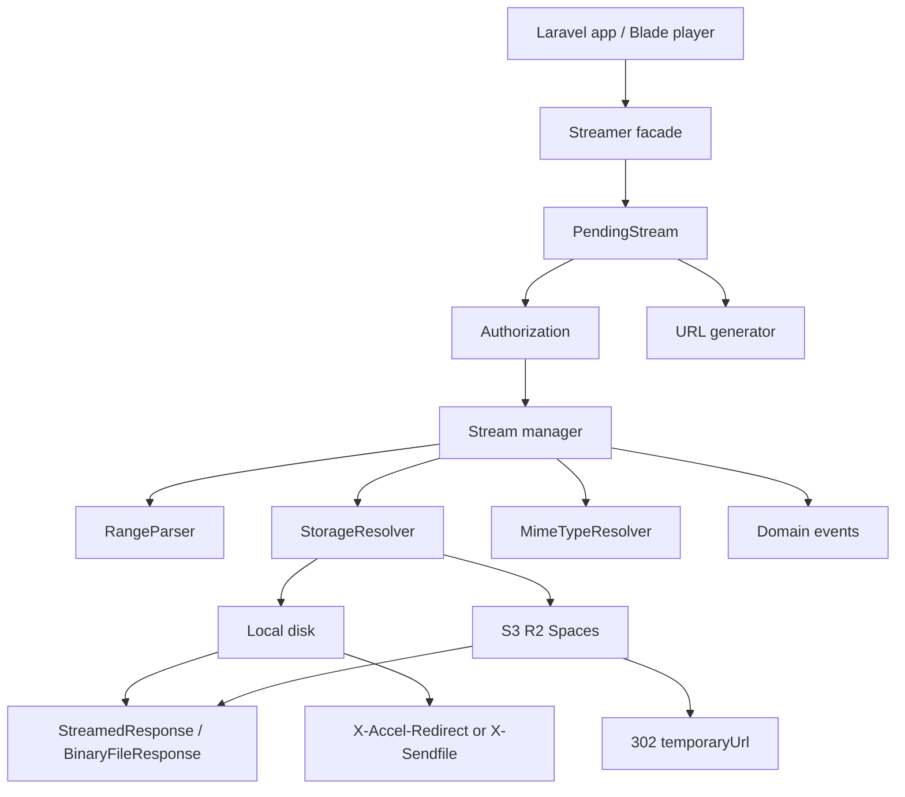

# Larastreamer v2 — Implementation Plan

**Package:** `rajurayhan/larastreamer`  
**Repo:** https://github.com/rajurayhan/larastreamer  
**This file is the source of truth for v2.**

Positioning:

> A lightweight, storage-agnostic video streaming engine for Laravel — HTTP Range, signed URLs, authorization, and cloud disks. Not a transcoding platform.

---

## 0. Decisions (draft + review combined)

The architecture draft and the security/2026 review disagreed in a few places. These are the locked calls.

| Topic | Decision | Why |
| --- | --- | --- |
| PHP / Laravel | PHP `^8.3`, Laravel `^12 \| ^13` | Current 2026 line. Do not keep Laravel 11 or PHP 8.2. |
| Core job | Delivery only | Range, disks, signed URLs, authz, correct HTTP. Not Mux. |
| FFmpeg / FFprobe | Not a core dependency | Optional later via a Processing contract. |
| HLS transcode | Not in v2.0 | Roadmap v2.3+. |
| HLS *serving* (signed playlist rewrite) | v2.2 | Useful, but it expands MIME/route surface. Keep 2.0 on progressive video. |
| Public API | Fluent pending builder | `Streamer::disk()->file()->stream()`. |
| v1 `VideoStream` | Keep, `@deprecated` | ~9k installs. Thin wrapper over the new response layer. Remove in v3. |
| Built-in route | **Off by default** | v1 auto-registered an unauthenticated file server. When enabled, `signed` is required. |
| Remote files | Prefer redirect / `temporaryUrl()` | Do not proxy GB through PHP. Proxy is opt-in. |
| Sendfile / X-Accel-Redirect | v2.0, opt-in | Production local files. Header only; no extra Composer deps. |
| Blade player + `embedData()` | v2.0 | Small views, no JS vendored in Composer. |
| Events | v2.0 | Cheap and listed in the product vision. |
| Streamable trait, metadata, subtitles | v2.1 | Optional, no schema. |
| Tests | Pest + Testbench | PHPStan level 8, Pint, GitHub Actions. |

---

## 1. Vision

v2 stays a **small Laravel package for video delivery**.

**In v2.0**

- HTTP Range (200 / 206 / 416), seeking, HEAD
- Laravel filesystem disks (local, S3, R2, Spaces, MinIO, Wasabi — via Flysystem, not custom SDKs)
- Three delivery modes: proxy stream, storage redirect, temporary URL
- App-signed URLs (`URL::temporarySignedRoute`)
- Pluggable authorization
- Path jail, MIME allowlist, package exceptions
- Configurable buffer, cache, Content-Disposition
- Optional nginx/Apache offload
- Optional Blade player
- Domain events
- Deprecated v1 `VideoStream` shim

**Not in core (ever as required deps)**

- FFmpeg, FFprobe, Redis, queues, a database, a third-party video SDK

---

## 2. Compatibility

```text
PHP      ^8.3
Laravel  ^12.0 || ^13.0
```

Composer conceptually:

```json
{
    "require": {
        "php": "^8.3",
        "illuminate/support": "^12.0 || ^13.0",
        "illuminate/http": "^12.0 || ^13.0",
        "illuminate/filesystem": "^12.0 || ^13.0",
        "illuminate/routing": "^12.0 || ^13.0"
    }
}
```

Drop `minimum-stability: dev`. Only require Illuminate components the package actually uses.

---

## 3. What v1 does wrong (must fix)

Current flow: `StreamController` concatenates `config('larastreamer.basepath') . '/' . $filename`, then `VideoStream` uses `header()`, `fopen()`, `fread()`, `exit`.

| Bug | Fix |
| --- | --- |
| Config published but never `mergeConfigFrom()` — unpublished apps resolve `basepath` to `/` | Always merge config |
| Unauthenticated `GET /stream/{filename}` and leftover `/streamer` | Routes off; drop `/streamer` |
| Path join with no jail | Disk + normalized path + `realpath` prefix check |
| Any MIME streamed | Allowlist; never trust client MIME |
| `App\Http\Controllers\Controller` | Invokable / framework controller only |
| `die()` / `exit()` / `header()` | Symfony/Laravel responses + exceptions |
| `Accept-Ranges: 0-{end}`, broken suffix ranges | Real `bytes` ranges via `RangeParser` |
| `Cache-Control: public` 30 days | Configurable; default `private` for signed/private content |
| Eager `app->make(Controller)` in `register()` | Bind, do not instantiate |

---

## 4. Public API (v2.0)

Namespace stays `Raju\Streamer`. Facade: `Raju\Streamer\Facades\Streamer`.

```php
use Raju\Streamer\Facades\Streamer;

return Streamer::file($absoluteOrRelative)->stream();

return Streamer::disk('videos')
    ->file('courses/lesson-01.mp4')
    ->stream();

return Streamer::disk('s3')
    ->file($video->path)
    ->authorize(fn ($path, $user) => $user?->can('viewVideo', $path))
    ->stream();

$url = Streamer::disk('s3')
    ->file($video->path)
    ->temporaryUrl(now()->addMinutes(30));

return Streamer::disk('s3')
    ->file($video->path)
    ->redirect();

return Streamer::disk('videos')
    ->file($path)
    ->download(); // Content-Disposition: attachment

$data = Streamer::disk('videos')
    ->file($path)
    ->embedData(); // [url, type, mime, expires_at]
```

Built-in route helper (only useful when routes are enabled):

```php
Streamer::signedUrl('courses/lesson-01.mp4', expires: now()->addMinutes(30));
```

Per-call `authorize()` and a global `Streamer::authorize(callable|object)` are both supported. Global default is “allow if the signature is valid” (or allow if the app called `stream()` from its own controller).

`Streamable` model trait is **v2.1**, not 2.0.

---

## 5. Architecture



### Three delivery modes

1. **Proxy** — `->stream()` — Laravel reads the disk stream in chunks. Use for local files, private buckets that cannot expose a URL, and when authorize/events must sit on every byte request.
2. **Redirect** — `->redirect()` — authorize, then 302 to `Storage::temporaryUrl()`. Preferred for large S3/R2 objects.
3. **Temporary URL** — `->temporaryUrl()` / `->signedUrl()` — return a string (cloud signed URL, or app-signed route URL when the built-in route is enabled).

Default remote strategy in config: `redirect` (do not proxy cloud objects unless asked).

### HTTP Range

Extract from `VideoStream` into `Range` + `RangeParser`.

Handle: `bytes=0-999`, `bytes=1000-`, `bytes=-500`. Invalid → `416` with `Content-Range: bytes */{size}`.

| Request | Status | Headers |
| --- | --- | --- |
| Full GET | 200 | `Content-Type`, `Content-Length`, `Accept-Ranges: bytes` |
| Valid Range | 206 | `Content-Length` of range, `Content-Range: bytes {start}-{end}/{size}` |
| Invalid Range | 416 | `Content-Range: bytes */{size}` |
| HEAD | same headers as GET | **no body** |

Buffer default `1024 * 1024` (configurable). Never load the whole file into memory. Never `exit`.

When the disk is local and offload is disabled, prefer Laravel/Symfony `BinaryFileResponse` (it already implements Range). Use `StreamedResponse` + `RangeParser` when streaming a Flysystem read-stream (remote proxy).

### Offload (local only)

```php
'offload' => [
    'enabled' => false,
    'driver' => 'nginx', // nginx | apache
    'prefix' => '/internal-videos/',
],
```

Empty response + `X-Accel-Redirect` or `X-Sendfile`. README ships a minimal nginx `internal` location. Tests assert headers only.

---

## 6. Directory structure (v2.0)

Do not invent a Processing tree until v2.3.

```text
src/
├── Contracts/
│   ├── Streamer.php
│   ├── Authorization.php
│   └── StorageResolver.php
├── Streaming/
│   ├── PendingStream.php
│   ├── VideoStreamer.php
│   ├── Range.php
│   ├── RangeParser.php
│   └── StreamOptions.php
├── Storage/
│   └── LaravelFilesystem.php
├── Http/
│   ├── Controllers/StreamController.php
│   └── Responses/VideoStreamResponse.php
├── Support/
│   └── MimeTypeResolver.php
├── Events/
│   ├── VideoStreamStarted.php
│   ├── VideoStreamCompleted.php
│   ├── VideoStreamFailed.php
│   └── VideoStreamUnauthorized.php
├── Exceptions/
│   ├── StreamException.php
│   ├── VideoNotFound.php
│   ├── InvalidRange.php
│   └── UnauthorizedStream.php
├── Facades/Streamer.php
├── Helpers/VideoStream.php          # deprecated shim
└── StreamServiceProvider.php

resources/views/components/player.blade.php
config/larastreamer.php
routes/web.php
tests/Feature/...
tests/Unit/...
```

Provider: `mergeConfigFrom`, publish config + views, `loadViewsFrom(..., 'larastreamer')`, register facade/bindings, load routes only if enabled. No eager controller `make()`.

---

## 7. Configuration

Publish as `config/larastreamer.php`. v1 `basepath` maps to `storage.disk` + `storage.path`.

```php
return [
    'route' => [
        'enabled' => false,
        'prefix' => 'stream',
        'middleware' => ['signed'],
        'name' => 'larastreamer.stream',
    ],

    'storage' => [
        'disk' => env('LARASTREAMER_DISK', 'local'),
        'path' => env('LARASTREAMER_PATH', 'uploads'),
        'remote' => [
            'strategy' => 'redirect', // redirect | proxy
        ],
    ],

    'streaming' => [
        'buffer_size' => 1024 * 1024,
        'max_age' => 3600,
        'cache' => 'private', // private | public
    ],

    'security' => [
        'signed_urls' => true,
        'default_expiration' => 1800,
    ],

    'allowed_mimes' => [
        'video/mp4',
        'video/webm',
        'video/ogg',
        'video/quicktime',
        'video/x-msvideo',
        'video/mpeg',
    ],

    'allowed_extensions' => ['mp4', 'webm', 'ogv', 'mov', 'avi', 'mpeg', 'mpg'],

    'offload' => [
        'enabled' => false,
        'driver' => 'nginx',
        'prefix' => '/internal-videos/',
    ],
];
```

---

## 8. Security

- Never `$base . '/' . $userInput`. Resolve through the disk; for local roots, `realpath` both sides and require `str_starts_with($target, $root . DIRECTORY_SEPARATOR)`.
- Nested relative paths (`folder/clip.mp4`) are allowed only inside the jail.
- Built-in route uses `?file=` (not `/{filename}`) so slashes are not a router problem.
- Reject traversal, missing files, directories, and disallowed MIME/extension with **404** (do not leak existence or real paths).
- Unauthorized → 403 via `UnauthorizedStream`.
- Signed URLs: Laravel signatures (tamper, expiry). Do not invent crypto.
- Authorize hook runs after `signed`, before any read.
- Client MIME is ignored. `MimeTypeResolver` uses the file / disk.
- Errors never include absolute server paths.
- No directory listing.
- Default cache for signed/private: `Cache-Control: private, max-age={n}`. Public cache is opt-in.

---

## 9. Exceptions, events, player

**Exceptions** (never `exit`): `StreamException`, `VideoNotFound`, `InvalidRange`, `UnauthorizedStream`.

**Events (payloads small):** path, disk, user id, range, strategy (`file` / `offload` / `proxy` / `redirect`). No analytics database.

**Player:** `<x-larastreamer::player src="clip.mp4" />` or `:url` / poster / autoplay. Native `<video>` for progressive files. Do not vendor JS. HLS.js only when HLS serving lands in v2.2.

---

## 10. v1 compatibility

```php
/** @deprecated Use Streamer::file($path)->stream() */
new \Raju\Streamer\Helpers\VideoStream($filePath);
```

Shim must not call `header()` / `exit()`. It delegates to the new streamer. Document the migration; remove the class in v3.

---

## 11. Tests and quality

```text
tests/Feature/
  StreamVideoTest.php
  RangeRequestTest.php
  InvalidRangeTest.php
  HeadRequestTest.php
  SignedUrlTest.php
  AuthorizationTest.php
  StorageTest.php
  PathTraversalTest.php
  OffloadHeaderTest.php
  ConfigMergeTest.php
tests/Unit/
  RangeParserTest.php
  StreamOptionsTest.php
  MimeTypeResolverTest.php
```

Must cover: GET 200, HEAD no body, ranges (start, mid, open, suffix), 416, missing/empty file, wrong MIME, signed / expired / invalid signature, authorize true/false, local disk, mocked S3 `temporaryUrl`, traversal (`../`, encoded), routes absent when disabled, unpublished config does not resolve to `/`, offload headers, download disposition.

**CI:** Pest, Pint, PHPStan 8 (goal 9 later).

```text
PHP 8.3 + Laravel 12
PHP 8.4 + Laravel 12
PHP 8.3 + Laravel 13
PHP 8.4 + Laravel 13
```

(skip a cell if a Laravel release does not support that PHP).

---

## 12. Documentation (README)

Installation, config, fluent API, disks, S3/R2 redirect vs proxy, signed URLs, authorization, Range/HEAD, download, offload nginx snippet, player, events, security, v1 migration (`basepath` → `disk`/`path`, signed routes, deprecated `VideoStream`), production notes.

---

## 13. Roadmap

```text
v2.0   Delivery core (this document)
v2.1   Streamable trait, metadata (size/mime always; duration/codec via optional FFprobe), subtitles/VTT URLs
v2.2   HLS/DASH serving: allow m3u8/ts/m4s, rewrite relative segment URIs to signed URLs
v2.3+  Optional Processing contract + FFmpeg/Shaka adapters (still not required)
v3     Remove VideoStream; adaptive bitrate / encryption only if the package is still the right home
```

---

## 14. Implementation phases

Incremental. Do not rewrite blindly. Run the suite after each phase.

1. **Characterize v1** — lock current routes, headers, and public classes; add characterization tests where useful.
2. **RangeParser + Range** — extract and test all range forms (including suffix).
3. **HTTP layer** — Symfony responses, 200/206/416/HEAD, delete `header()`/`exit()` from the hot path.
4. **Storage + jail + MIME** — `mergeConfigFrom`, disks, path prefix, allowlists.
5. **Fluent API + facade** — `PendingStream` (`stream`, `redirect`, `temporaryUrl`, `download`, `authorize`, `embedData`).
6. **Security routes** — opt-in signed `GET /stream?file=`, authorize hook, traversal tests.
7. **Offload, events, player, cache, disposition.**
8. **Deprecated `VideoStream` shim.**
9. **Pint, PHPStan 8, CI matrix, README + CHANGELOG + LICENSE.**

---

## 15. Definition of done (v2.0)

- [ ] PHP 8.3 / 8.4, Laravel 12 / 13
- [ ] `mergeConfigFrom` — unpublished config never resolves to `/`
- [ ] Fluent API: `disk`, `file`, `stream`, `redirect`, `temporaryUrl`, `signedUrl`, `authorize`, `download`, `embedData`
- [ ] 200 / 206 / 416 / HEAD correct
- [ ] Suffix and open-ended ranges correct
- [ ] No `die()`, `exit()`, or raw `header()` on the v2 path
- [ ] Local + S3-compatible disks
- [ ] Remote default is redirect / temporary URL
- [ ] Path traversal tests pass
- [ ] MIME/extension allowlist
- [ ] Signed URLs + expiry
- [ ] Authorize hook (403)
- [ ] Routes off by default; `/streamer` gone
- [ ] Optional sendfile headers
- [ ] Blade player
- [ ] Events
- [ ] Configurable buffer + cache + disposition
- [ ] Package exceptions, no leaked real paths
- [ ] `VideoStream` deprecated but working
- [ ] Pest + PHPStan 8 + Pint + CI
- [ ] README + v1 migration guide

---

## 16. Agent rules

1. Inspect the real repo; do not trust the v1 README.
2. Prefer Laravel-native APIs (`Storage`, `BinaryFileResponse`, `URL::temporarySignedRoute`).
3. Keep runtime dependencies minimal.
4. Do not add FFmpeg, HLS transcode, a database, or a Processing tree in v2.0.
5. `declare(strict_types=1)`, typed properties, readonly where it fits, enums if they clarify (delivery mode, offload driver). No static mutable state.
6. `final` by default unless extension is a documented extension point (contracts).
7. Tests alongside each phase. Security tests must pass before calling v2.0 done.
8. Verify Range behavior with real HTTP requests, not only unit tests.
